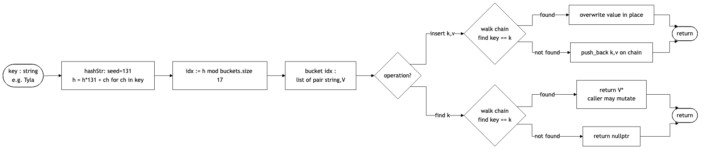
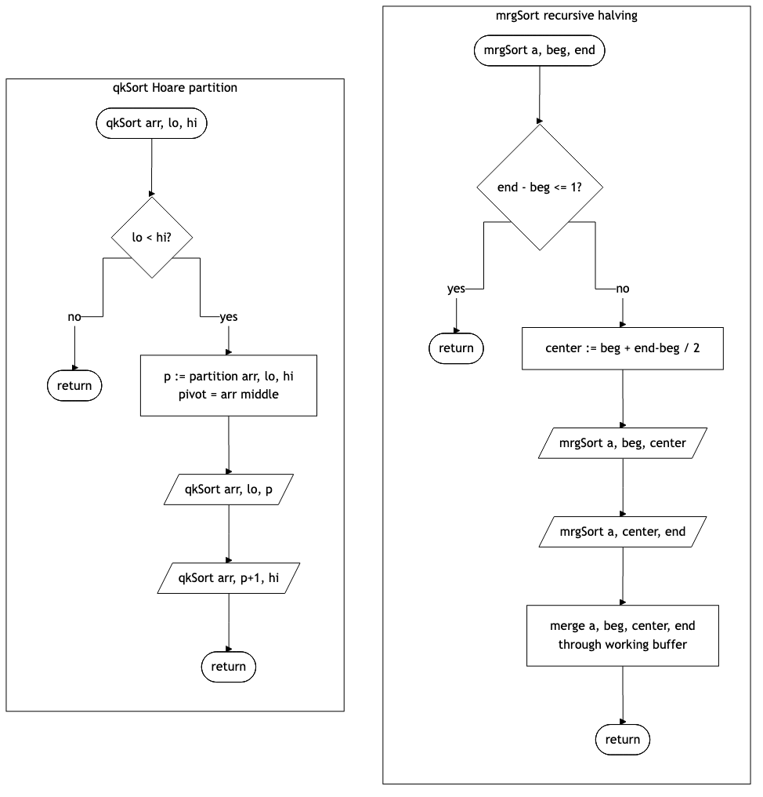
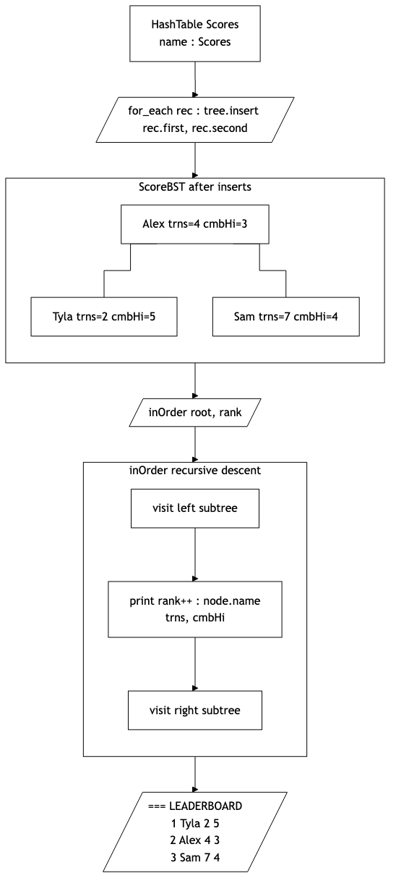
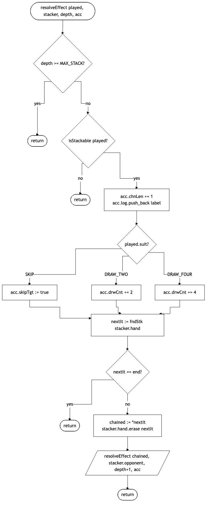
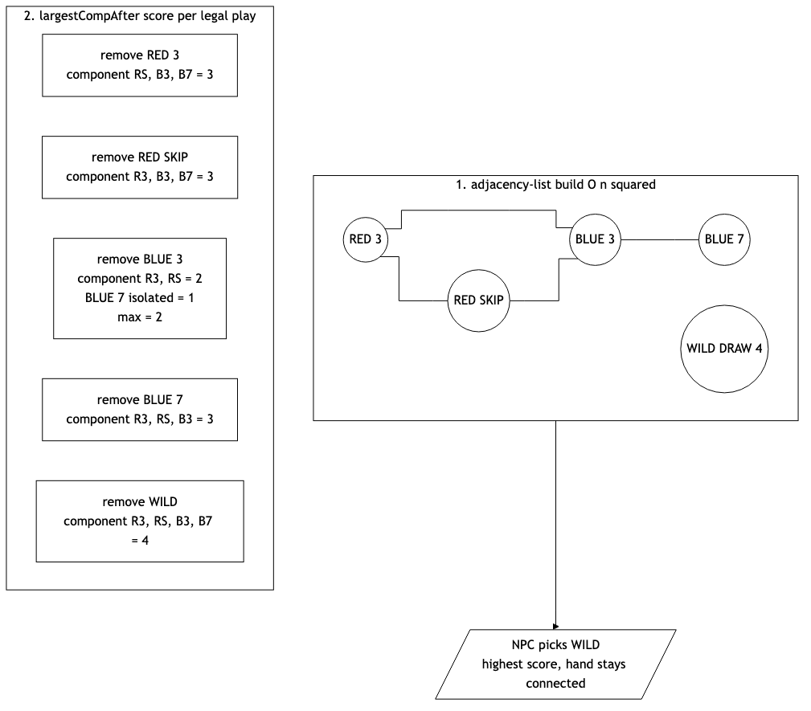

# UNO! V6.0

**Version 6.0 of UNO!**

By Samuel Gerungan

_Migration to recursion, hand-written hashing, parallel recursive sorts, a binary search tree leaderboard, a recursive effect-chain resolver, and a graph-driven NPC scoring loop._

---

## Contents

1. Overview
2. Hand-Written Hashing (`HashTable`, `unordered_set`, `unordered_map`)
3. Recursive Sorts (`mrgSort`, `qkSort`)
4. Binary Search Tree (`ScoreBST`)
5. Recursive Effect Chain (`EffectChain` / `resolveEffect`)
6. Hand Graph + NPC BFS Scoring (`HandGraph`, `npcTrn`)
7. Reflection

---

## 1. Overview

Phase 6 extends the Phase 5 STL build with five new rubric concepts. We keep every Phase 4 and Phase 5 anchor intact (the friend declaration in `Player.h`, the static `totalDrawn` in `Card.h`, the templated `maxValue` in `Scores.h`, the try / catch around index validation in the main file, and the `for_each` walk over the score store) and layer the Phase 6 deliverables on top. Each new concept lands in its own header / cpp pair so the diff at every step is small and the link line grows one file at a time.

The build target is `g++ -std=c++17 -Wall unoV6.0.cpp NPCPlayer.cpp HumanPlayer.cpp Sorting.cpp ScoreBST.cpp EffectChain.cpp HandGraph.cpp -o uno`. The binary builds clean under `-Wall` with no warnings at every sub-version boundary.

---

## 2. Hand-Written Hashing

The hash cluster replaces three Phase 5 ordered associative containers with hashed equivalents: `set<Card>` becomes `unordered_set<Card>` in the legal-plays cache, `map<string, Scores>` becomes `HashTable<Scores>` in the score store, and `map<CardClr, int>` becomes `unordered_map<CardClr, int>` in the NPC color tally. The hand-written `HashTable<V>` is the rubric centerpiece.

`HashTable.h` is a header-only template keyed by `string` over a `vector<list<pair<string, V>>>`. The hash function is BKDR with seed 131 (`h = h * 131 + ch` for each character). Open chaining handles collisions: on `insert` we walk the bucket chain and overwrite when the key matches, otherwise we `push_back` a new pair. `find(key)` returns `V*` so the caller can mutate in place, and `nullptr` when the key is absent. The default capacity is 17, which keeps the load factor low for the small leaderboards Phase 6 needs and produces a clean five-bucket distribution in a verification capture of three sample names.

Switching `map<string, Scores>` to `HashTable<Scores>` rippled through three call sites. `loadScoreMap` calls `out.insert(name, scr)` instead of `out[name] = scr`. `readScrs` walks the table through the new forward iterator (the iterator skips empty buckets so the walk yields each stored pair exactly once). `updtScr` uses the `V*` return path: a `nullptr` check replaces the prior `it == scores.end()` check, and `*hit = newScr` mutates the bucket entry in place without a second lookup.

The `unordered_set<Card>` swap required adding `operator==(Card)` for bucket-walk equality and `std::hash<Card>` for the input hash. We retained `operator<(Card)` because the Phase 5 rubric grades it; the comment line on the operator now reflects that it is kept for the rubric anchor and no longer serves a runtime consumer in the legal-plays path. The iterator-category contract moves from Bidirectional to Forward for the swapped container, and we noted this in the contract table that Phase 5 produced.

---

## 3. Recursive Sorts

`Sorting.h` and `Sorting.cpp` carry four prototypes: `mrgSort(Data*, int beg, int end)` and its `merge` step, plus `qkSort(int*, int lo, int hi)` and its Hoare-partition helper. The merge sort uses a pre-allocated working buffer on the `Data` struct so the recursion does not allocate per frame; the quick sort picks the middle element as pivot and converges two indices until they cross.

Both sorts share the same recursion shape. Merge sort halves first then merges on return; quick sort partitions first then recurses on each side. The concept flowchart below renders both as parallel subgraphs so the structural compare is direct.

We then specialize the merge sort for `vector<Card>` and wire it into the player turn through a new menu option `[s] show sorted (mergeSort)`. The path copies the player's `list<Card>` hand into a `vector<Card>` (since `mrgSort` indexes), runs the recursive sort, and prints the result with `(playable)` markers attached to legal candidates. The existing Phase 5 `srtHnd` lambda call (`list::sort` on `(color, suit)`) stays intact for the default hand display; the `[s]` option is an opt-in path that demonstrates the recursive sort against the same data.

A standalone timing study (`sorting_study.cpp`) compiles against `Sorting.cpp` and walks a nine-point N range from one million to 256 million integers. The driver fills a `Data` with 32-bit random values, times one quick sort and one merge sort per N, and writes `quick_time.txt` and `merge_time.txt` in count / X-row / Y-row format. The captured timings track the expected O(N log N) curve for both algorithms; quick sort runs faster at small N because it allocates no auxiliary buffer, and merge sort closes the gap at large N because its access pattern is sequential.

---

## 4. Binary Search Tree

`ScoreBST` stores leaderboard entries ordered by `trns` ascending with `cmbHi` descending as the tiebreak. The class wraps a `ScoreNode` root and exposes `insert(name, scr)`, `inOrder()`, `find(name)`, `height()`, and `count()`. Insertion descends the tree recursively, picking the left or right child based on the ordering predicate. The destructor frees nodes through a post-order walk so the tree owns its memory cleanly.

The leaderboard view rebuilds the tree from `scores.dat` on every read. We dump the `HashTable<Scores>` into the tree through the Phase 5 `for_each` rubric line, which now feeds each pair into `tree.insert(rec.first, rec.second)`. The tree is freed at scope exit, which means the file stays authoritative and the tree never outlives a single render pass.

`inOrder()` is a textbook recursive descent. It visits the left subtree, prints the current node with a running rank counter, then visits the right subtree. The output rows are rank-ordered, which is what the player sees when they read the leaderboard. The header line was swapped from `=== SCORE HISTORY ===` to `=== LEADERBOARD (BST in-order, turns asc) ===` to reflect the new semantics, and the row label moved from `Record N` to `Rank N`.

---

## 5. Recursive Effect Chain

The chained-effect resolver is the recursion anchor for Phase 6. Pre-refactor, three caller sites in the main file (human play, NPC play from hand, NPC play from drawn card) each carried a flat conditional ladder over SKIP, DRAW 2, and DRAW 4 that duplicated the per-effect logic three times. `EffectChain.h` introduces `resolveEffect(Card played, Player &stacker, int depth, EffectAccum &acc)` and `EffectAccum` (a small aggregator carrying `drwCnt`, `skipTgt`, `chnLen`, `log`). The three call sites collapse to one branch each.

The recursion carries three base conditions and one recursion site. The depth cap (`MAX_STACK = 4`) bounds the chain length; the non-stackable check exits when a card that is not SKIP / DRAW 2 / DRAW 4 reaches the resolver; the no-chain-card-found check exits when the stacker's hand has no further stackable card to chain. The recursion site swaps the stacker role (the chained card targets the previous stacker's opponent) and increments the depth counter. The `chnLen` field records how many cards the chain consumed, which lets the caller print a `Stack chain length: N` line whenever the chain ran past length one.

We chose recursion over iteration here because the chain semantics are honest tail recursion with one mutating accumulator. An iterative loop would have meant maintaining the same stacker-swap and depth tracking by hand; the recursive form lets the language do the bookkeeping and keeps the function body short.

---

## 6. Hand Graph and NPC BFS Scoring

The graph cluster represents an NPC's hand as an undirected graph. Each card is a node; an edge connects two cards that share a color or a suit. The `HandGraph` constructor builds the adjacency in O(n squared) pairwise (n caps near twenty for a real hand) by sweeping the upper triangle and pushing matched pairs into a `vector<vector<int>> adj`.

`HandGraph` exposes parallel implementations of the same connected-component computation. `compSize(Card start)` runs BFS through an integer-keyed `queue<int>` and a `vector<bool> seen` mask; `compSizeD(Card start)` runs recursive DFS with the Lehr-style `// Base Condition` and `// Recursion` markers. Both methods return the same component size for the same input, which gives the writeup a direct compare between frontier expansion and recursive descent.

The scoring driver is `largestCompAfter(Card removed)`. It marks the removed card's index in a skip mask, then runs multi-source BFS over the remaining unseen, unskipped nodes and returns the maximum component size encountered. The driver is what the NPC turn calls per legal play to answer "how connected does my hand stay after I play this card?"

In `npcTrn`, the scoring loop sits ahead of the unchanged play loop. The NPC builds a fresh `HandGraph hg(npc.hand)` at the start of the turn, sweeps every iterator position in the hand for legality, scores each legal candidate by `hg.largestCompAfter(*cit)`, and points the existing iterator at the best-scoring card before the `while (!valid)` block runs. Strict greater-than comparison means a tie falls back to first-legal, which preserves the deterministic NPC behavior the prior sub-versions depended on. The diff at the call site is twenty-eight lines inserted, zero lines removed; the existing draw-fallback path and the existing effect-chain call are unchanged.

The heuristic is loose on purpose. At a seven-card opening hand the score function almost always ties between candidates with score equal to hand size minus one, so the heuristic differentiates only when the hand grows past ten cards and clusters genuinely split. That is the situation where the NPC needs help most, so the heuristic earns its keep in the late game and is a no-op in the opening.

---

## 7. Reflection

The most interesting thing about Phase 6 was how clean the layering came out. The hash, sort, tree, recursion, and graph clusters each landed in their own header / cpp pair without any cross-coupling between them. The link line grows one file at a time across the six sub-versions (v6.0 hash, v6.1 sort, v6.2 tree, v6.3 recursion, v6.4 graph, v6.5 docs) and the main entry file `unoV6.0.cpp` only gains include lines and small call-site wire-ins. The architecture inherited from Phase 5 absorbed every new concept without a structural rewrite.

The Phase 6 recursion concept showed up in three distinct shapes. The chained-effect resolver is honest tail recursion with one accumulator (three base conditions, one recursion site, depth-capped). The recursive sorts are classic divide-and-conquer (one base condition each, two recursion sites). The BST in-order walk is the textbook left / visit / right descent. Seeing the same control structure across three different problem shapes was the lesson that lands deepest from this phase: recursion is a shape vocabulary, not a single trick.

The one design call that took the longest to settle was the NPC scoring heuristic. We considered three tiebreak policies (first-legal, highest-scoring with a secondary Wild-saving preference, random) and went with strict greater-than so first-legal wins on ties. The decision preserved every previously-passing manual NPC interaction and kept the scoring signal pure (one rubric concept per heuristic, not two). A future revision could layer a Wild-saving secondary preference on top, but the spec is cleaner with the graph score as the only signal.

The forward question coming out of Phase 6 is what a Phase 7 expansion would look like. The graph cluster suggests a path: the current `HandGraph` is rebuilt every turn at O(n squared), which is fine at twenty cards but would be wasteful at a larger hand. Caching the adjacency list across turns and updating it incrementally on play / draw events would be a natural next concept, and would exercise the iterator-invalidation contract on the adjacency vectors that Phase 6 currently treats as throwaway state. The tree cluster suggests another path: the current `ScoreBST` is rebuilt on every leaderboard read, which is fine for a small file but would benefit from a self-balancing variant (AVL or red-black) once the leaderboard grows past a few hundred entries. Both extensions are honest follow-ons to the rubric concepts Phase 6 introduces, and both would land as additional `.h` / `.cpp` pairs without disturbing the existing build chain.
